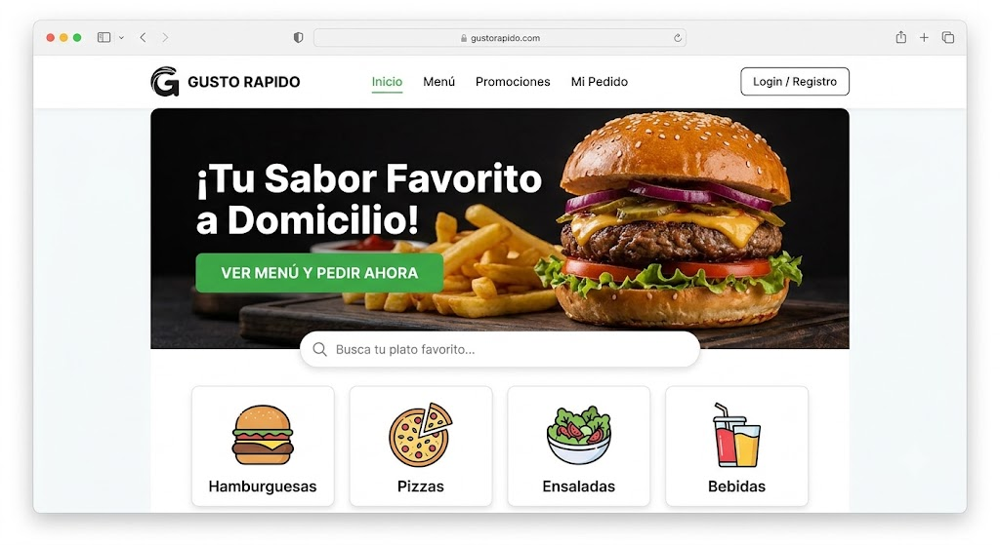
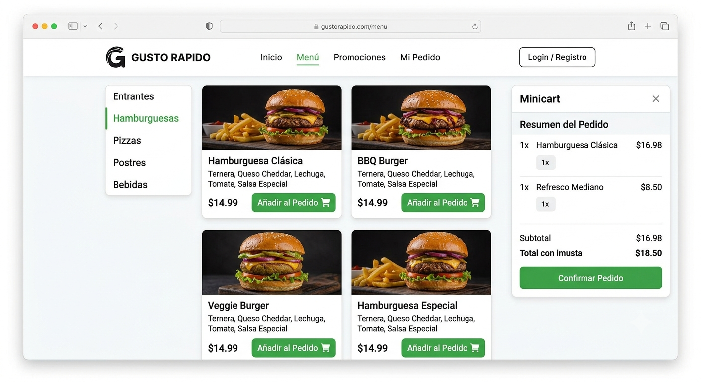
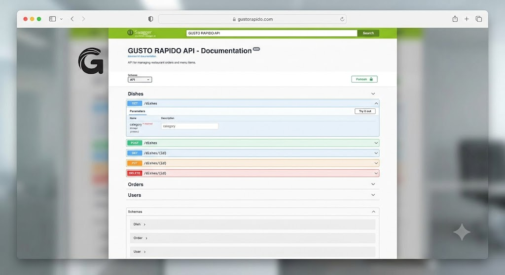

# 📚 Restaurante x

Sistema de gestión de restaurante. Permite administrar pedidos mediante una interfaz web moderna con **React + Vite** en el frontend y una **API REST en .NET** en el backend, con base de datos en **SQL Server**.

---


## 🖼️ Capturas de pantalla   <-- AQUÍ VA

### Frontend - Pantalla principal


### Frontend - Gestión de libros


### Backend - API con Swagger


---

## 🚀 Tecnologías

- **Frontend:** React + Vite, TypeScript, TailwindCSS
- **Backend:** .NET 6/7 Web API (C#)
- **Base de Datos:** SQL Server
- **ORM / Acceso a datos:** Entity Framework Core
- **Control de versiones:** Git + GitHub

---

## 📂 Estructura del proyecto

```

restaurante_x/
│── frontend/       # Cliente web (React + Vite)
│── backend/        # API REST en .NET
│── database/       # Scripts SQL para crear la base de datos
│── README.md       # Documentación del proyecto
│── .gitignore      # Archivos ignorados por Git

````

---

## ⚙️ Instalación y ejecución

### 🔹 1. Clonar el repositorio
```bash
git clone https://github.com/G-E-L-O/biblioteca-facultad.git
cd biblioteca-facultad
````

### 🔹 2. Configurar la base de datos

1. Crear una base de datos en SQL Server (ejemplo: `BibliotecaDB`).

2. Ejecutar los scripts de la carpeta `database/`:

3. Actualizar la cadena de conexión en el archivo:

   ```
   backend/appsettings.json
   ```

Ejemplo:

```json
"ConnectionStrings": {
  "DefaultConnection": "Server=localhost;Database=BibliotecaDB;User Id=sa;Password=TuPassword123;"
}
```

---

### 🔹 3. Ejecutar el Backend (.NET)

Desde la carpeta `backend/`:

```bash
dotnet restore
dotnet build
dotnet run
```

La API estará disponible en:

```
http://localhost:5000
```

---

### 🔹 4. Ejecutar el Frontend (React + Vite)

Desde la carpeta `frontend/`:

```bash
npm install
npm run dev
```

El frontend estará disponible en:

```
http://localhost:5173
```

---

## 📖 Endpoints principales (API .NET)

| Método | Endpoint           | Descripción                   |
| ------ | ------------------ | ----------------------------- |
| GET    | `/api/libros`      | Lista todos los libros        |
| GET    | `/api/libros/{id}` | Obtiene un libro por ID       |
| POST   | `/api/libros`      | Crea un nuevo libro           |
| PUT    | `/api/libros/{id}` | Actualiza datos de un libro   |
| DELETE | `/api/libros/{id}` | Elimina un libro              |
| GET    | `/api/usuarios`    | Lista todos los usuarios      |
| POST   | `/api/prestamos`   | Registra un préstamo de libro |

---

## 👨‍💻 Colaboradores

* G-E-L-O
* AntonyPC-13
* Gianf22
* Erick Quispe huari
* JDC150

---

## 📜 Licencia

Este proyecto es de uso académico y educativo.
